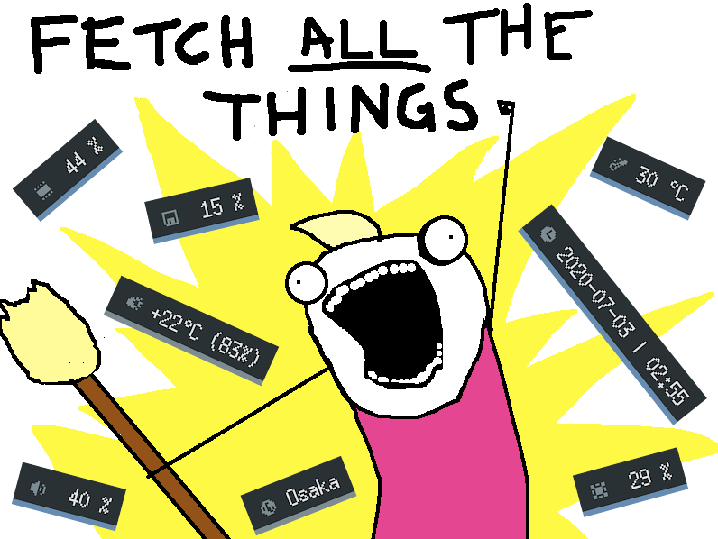

# fetch-all-the-things 

A list of scripts and programs that can fetch information and print it to `stdout`. Possible use cases for such utilities:

- Check information on the CLI
- For use in custom fetch scripts
- For use in notifications
- For use in status bars

Please open an issue or send a pull request to add to the list or report entries that are outdated or shouldn't be on the list in the first place.

# Collections

These are projects that contain a multitude of fetch scripts / programs. Note that, depending on their intended purpose, some of these might have additional files and/or functionality that goes beyond printing information to stdout. It should still be possible to use them for that, however.

- [candies](https://github.com/domsson/candies) C programs made with status bars in mind; most of these have the option to be kept running
  - [cpu-proc](https://github.com/domsson/candies/tree/master/cpu-proc) CPU usage in %
  - [datetime](https://github.com/domsson/candies/tree/master/datetime) date and time
  - [disk-statvfs](https://github.com/domsson/candies/tree/master/disk-statvfs) disk usage in %
  - [mc-server](https://github.com/domsson/candies/tree/master/mc-server) Minecraft Server Info
  - [mem-proc](https://github.com/domsson/candies/tree/master/mem-proc) RAM usage in % via /proc/meminfo
  - [mem-sysinfo](https://github.com/domsson/candies/tree/master/mem-sysinfo) RAM usage in % via sysinfo()
  - [temp-sensors](https://github.com/domsson/candies/tree/master/temp-sensors) system temperature via libsensors
  - [twitch-chat](https://github.com/domsson/candies/tree/master/twitch-chat) Twitch chat messages (filtered)
  - [volume-pulse](https://github.com/domsson/candies/tree/master/volume-pulse) volume via libpulse
  - [wmname-xcb](https://github.com/domsson/candies/tree/master/wmname-xcb) title of the focused window and window manager name via libxcb
- [fetchutils](https://github.com/lptstr/fetchutils) small Shell scripts to retrieve system information; made with fetch scripts in mind
  - [disk.sh](https://github.com/lptstr/fetchutils/blob/master/src/disk.sh) disk usage
  - [editor.sh](https://github.com/lptstr/fetchutils/blob/master/src/editor.sh) get editor name
  - [mem.sh](https://github.com/lptstr/fetchutils/blob/master/src/mem.sh) RAM usage
  - [os.sh](https://github.com/lptstr/fetchutils/blob/master/src/os.sh) operating system
  - [pkgs.sh](https://github.com/lptstr/fetchutils/blob/master/src/pkgs.sh) number of packages
  - [res.sh](https://github.com/lptstr/fetchutils/blob/master/src/res.sh) screen dimensions
  - [cpu.sh](https://github.com/lptstr/fetchutils/blob/master/src/temp.sh) CPU temperature
  - [upt.sh](https://github.com/lptstr/fetchutils/blob/master/src/upt.sh) uptime
  - [wm.sh](https://github.com/lptstr/fetchutils/blob/master/src/wm.sh) window manager
- [i3blocks-contrib](https://github.com/vivien/i3blocks-contrib) mostly Shell and Python scripts; made with i3blocks in mind
  - [afs](https://github.com/vivien/i3blocks-contrib/tree/master/afs) AFS directory usage
  - [apt-upgrades](https://github.com/vivien/i3blocks-contrib/tree/master/apt-upgrades) pending aptitude upgrades
  - [aur-update](https://github.com/vivien/i3blocks-contrib/tree/master/arch-update) AUR updates
  - [backlight](https://github.com/vivien/i3blocks-contrib/tree/master/backlight) screen brightness
  - [bandwidth](https://github.com/vivien/i3blocks-contrib/tree/master/bandwidth) bandwidth information
  - [bandwidth2](https://github.com/vivien/i3blocks-contrib/tree/master/bandwidth2) bandwidth usage (written in C)
  - [bandwidth3](https://github.com/vivien/i3blocks-contrib/tree/master/bandwidth3) bandwidth usage
  - [battery-poly](https://github.com/vivien/i3blocks-contrib/tree/master/battery-poly) battery info
  - [battery](https://github.com/vivien/i3blocks-contrib/tree/master/battery) battery info
  - [battery2](https://github.com/vivien/i3blocks-contrib/tree/master/battery2) battery info
  - [batterybar](https://github.com/vivien/i3blocks-contrib/tree/master/batterybar) battery level in squares
  - [calendar](https://github.com/vivien/i3blocks-contrib/tree/master/calendar) current date and time
  - [cpu\_usage](https://github.com/vivien/i3blocks-contrib/tree/master/cpu_usage) CPU usage
  - [cpu\_usage2](https://github.com/vivien/i3blocks-contrib/tree/master/cpu_usage2) CPU usage (written in C)
  - [cpu\_util\_detailed](https://github.com/vivien/i3blocks-contrib/tree/master/cpu_util_detailed) CPU utilization
  - [disk\_io](https://github.com/vivien/i3blocks-contrib/tree/master/disk-io) disk reads/writes
  - [disk](https://github.com/vivien/i3blocks-contrib/tree/master/disk) disk usage
  - [docker](https://github.com/vivien/i3blocks-contrib/tree/master/docker) number of running Docker containers
  - [email](https://github.com/vivien/i3blocks-contrib/tree/master/email) number of new emails via IMAP
  - [essid](https://github.com/vivien/i3blocks-contrib/tree/master/essid) wifi ESSID
  - [go](https://github.com/vivien/i3blocks-contrib/tree/master/go) installed Go version
  - [gpu-load](https://github.com/vivien/i3blocks-contrib/tree/master/gpu-load) nVidia GPU load
  - [iface](https://github.com/vivien/i3blocks-contrib/tree/master/iface) network interface status
  - [kbdd\_layout](https://github.com/vivien/i3blocks-contrib/tree/master/kbdd_layout) keyboard layout via dbus and kbdd
  - [key\_layout](https://github.com/vivien/i3blocks-contrib/tree/master/key_layout) keyboard layout via setxkbmap
  - [keyindicator](https://github.com/vivien/i3blocks-contrib/tree/master/keyindicator) capslock / numlock status indicator
  - [kubernetes](https://github.com/vivien/i3blocks-contrib/tree/master/kubernetes) current Kubernetes context and namespace
  - [load\_average](https://github.com/vivien/i3blocks-contrib/tree/master/load_average) system load average
  - [mediaplayer](https://github.com/vivien/i3blocks-contrib/tree/master/mediaplayer) generic media player status
  - [memory](https://github.com/vivien/i3blocks-contrib/tree/master/memory) RAM usage
  - [nm-vpn](https://github.com/vivien/i3blocks-contrib/tree/master/nm-vpn) VPN status/name via nmcli
  - [openvpn](https://github.com/vivien/i3blocks-contrib/tree/master/openvpn) OpenVPN
  - [ssid](https://github.com/vivien/i3blocks-contrib/tree/master/ssid) wifi SSID
  - [sway-focusedwindow](https://github.com/vivien/i3blocks-contrib/tree/master/sway-focusedwindow) Sway WM focused window title
  - [systemd\_unit](https://github.com/vivien/i3blocks-contrib/tree/master/systemd_unit) systemd unit status
  - [tahoe-lafs](https://github.com/vivien/i3blocks-contrib/tree/master/tahoe-lafs) tahoe-lafs grid status
  - [temperature](https://github.com/vivien/i3blocks-contrib/tree/master/temperature) system temperatures
  - [time](https://github.com/vivien/i3blocks-contrib/tree/master/time) current time
  - [usb](https://github.com/vivien/i3blocks-contrib/tree/master/usb) USB device info
  - [volume-pulseaudio](https://github.com/vivien/i3blocks-contrib/tree/master/volume-pulseaudio) system volume and default playback device
  - [volume](https://github.com/vivien/i3blocks-contrib/tree/master/volume) system volume
  - [wifi](https://github.com/vivien/i3blocks-contrib/tree/master/wifi) wifi connection strength
  - [wlan-dbm](https://github.com/vivien/i3blocks-contrib/tree/master/wlan-dbm) wifi interface link quality in dBm or percent
  - [xkb\_layout](https://github.com/vivien/i3blocks-contrib/tree/master/xkb_layout) keyboard layout
- [polybar-scripts](https://github.com/polybar/polybar-scripts) Shell and Python scripts; written with polybar in mind
  - [battery-combined-shell](https://github.com/polybar/polybar-scripts/tree/master/polybar-scripts/battery-combined-shell) battery status
  - [battery-combined-tlp](https://github.com/polybar/polybar-scripts/tree/master/polybar-scripts/battery-combined-tlp) battery status via TLP
  - [battery-combined-udev](https://github.com/polybar/polybar-scripts/tree/master/polybar-scripts/battery-combined-udev) battery status via udev
  - [battery-cyberpower](https://github.com/polybar/polybar-scripts/tree/master/polybar-scripts/battery-cyberpower) battery status for CyberPower UPS devices
  - [inbox-imap-pythonpgp](https://github.com/polybar/polybar-scripts/tree/master/polybar-scripts/inbox-imap-pythongpg) shows if there are unread mails in your IMAPs inbox
  - [inbox-imap-shellnetrc](https://github.com/polybar/polybar-scripts/tree/master/polybar-scripts/inbox-imap-shellnetrc) shows if there are unread mails in your IMAP inbox
  - [inbox-imap-shellpass](https://github.com/polybar/polybar-scripts/tree/master/polybar-scripts/inbox-imap-shellpass) shows if there are unread mails in your IMAP inbox
  - [inbox-pop3-shellnetrc](https://github.com/polybar/polybar-scripts/tree/master/polybar-scripts/inbox-pop3-shellnetrc) shows if there are unread mails in your POP3 inbox
  - [info-airqualityindex](https://github.com/polybar/polybar-scripts/tree/master/polybar-scripts/info-airqualityindex) local World Air Quality Index
  - [info-docker](https://github.com/polybar/polybar-scripts/tree/master/polybar-scripts/info-docker) number of docker containers in a certain state
  - [info-dualshock4](https://github.com/polybar/polybar-scripts/tree/master/polybar-scripts/info-dualshock4) battery level of a DualShock 4 Controller
  - [info-ethermine](https://github.com/polybar/polybar-scripts/tree/master/polybar-scripts/info-ethermine) current hashrate (in MH/s) for your ethermine account
  - [info-eyestrain](https://github.com/polybar/polybar-scripts/tree/master/polybar-scripts/info-eyestrain) eyestrain break indicator according to 20-20-20 rule
  - [info-gitlab-pipelines](https://github.com/polybar/polybar-scripts/tree/master/polybar-scripts/info-gitlab-pipelines) number of succeeded, running and failed gitlab-pipelines triggered by a user
  - [info-hackspeed](https://github.com/polybar/polybar-scripts/tree/master/polybar-scripts/info-hackspeed) typing speed
  - [info-hexdate](https://github.com/polybar/polybar-scripts/tree/master/polybar-scripts/info-hexdate) current date in hex format
  - [info-hlwm-workspaces](https://github.com/polybar/polybar-scripts/tree/master/polybar-scripts/info-hlwm-workspaces) herbstluftwm workspaces
  - [info-kernel](https://github.com/polybar/polybar-scripts/tree/master/polybar-scripts/info-kernel) kernel version
  - [info-pingrtt](https://github.com/polybar/polybar-scripts/tree/master/polybar-scripts/info-pingrtt) ping result
  - [info-projecthamster](https://github.com/polybar/polybar-scripts/tree/master/polybar-scripts/info-projecthamster) Hamster Time Tracker information
  - [info-redshift-temp](https://github.com/polybar/polybar-scripts/tree/master/polybar-scripts/info-redshift-temp) current color temperature
  - [info-softwarecounter](https://github.com/polybar/polybar-scripts/tree/master/polybar-scripts/info-softwarecounter) number of specified running software including GUIs and processes
  - [info-ssh-sessions](https://github.com/polybar/polybar-scripts/tree/master/polybar-scripts/info-ssh-sessions) count of current ssh sessions as well as the public IP address of the fist session
  - [info-taskspooler](https://github.com/polybar/polybar-scripts/tree/master/polybar-scripts/info-taskspooler) number of queues/runtimes for one or more task spooler servers
  - [info-tmux-sessions](https://github.com/polybar/polybar-scripts/tree/master/polybar-scripts/info-tmux-sessions) tmux sessions
  - [info-todotxt](https://github.com/polybar/polybar-scripts/tree/master/polybar-scripts/info-todotxt) shows todo.txt items due
  - [info-trash](https://github.com/polybar/polybar-scripts/tree/master/polybar-scripts/info-trash) number of files in you trash directory
  - [info-usbtoserial](https://github.com/polybar/polybar-scripts/tree/master/polybar-scripts/info-usbtoserial) shows the USB-to-Serial converters that are connected
  - [info-wifionice](https://github.com/polybar/polybar-scripts/tree/master/polybar-scripts/info-wifionice) information about the current ICE train of Deutsche Bahn
  - [info-wmname](https://github.com/polybar/polybar-scripts/tree/master/polybar-scripts/info-wmname) value of the window manager name property of the root window
  - [info-xampp](https://github.com/polybar/polybar-scripts/tree/master/polybar-scripts/info-xampp) status of XAMPP services, if running
  - [isrunning-claudius](https://github.com/polybar/polybar-scripts/tree/master/polybar-scripts/isrunning-claudius) report the state of claudius, the alternative filepicker for Discord
  - [isrunning-compton](https://github.com/polybar/polybar-scripts/tree/master/polybar-scripts/isrunning-compton) shows if compton is running
  - [isrunning-dropbox](https://github.com/polybar/polybar-scripts/tree/master/polybar-scripts/isrunning-dropbox) shows if the dropbox client is running
  - [isrunning-offlineimap](https://github.com/polybar/polybar-scripts/tree/master/polybar-scripts/isrunning-offlineimap) shows if offlineimap is running
  - [isrunning-service](https://github.com/polybar/polybar-scripts/tree/master/polybar-scripts/isrunning-service) shows if a systemd service is running
  - [network-ipinfo.io](https://github.com/polybar/polybar-scripts/tree/master/polybar-scripts/network-ipinfo.io) public IP address and country of origin via ipinfo.io
  - [network-localip](https://github.com/polybar/polybar-scripts/tree/master/polybar-scripts/network-localip) local IP of the current connection
  - [network-networkmanager](https://github.com/polybar/polybar-scripts/tree/master/polybar-scripts/network-networkmanager) status of NetworkManager
  - [network-publicip](https://github.com/polybar/polybar-scripts/tree/master/polybar-scripts/network-publicip) public IP of the current connection
  - [network-traffic](https://github.com/polybar/polybar-scripts/tree/master/polybar-scripts/network-traffic) current network traffic
  - [news-archlinux](https://github.com/polybar/polybar-scripts/tree/master/polybar-scripts/news-archlinux) Arch Linux RSS news
  - [notification-chess](https://github.com/polybar/polybar-scripts/tree/master/polybar-scripts/notification-chess) indicates whether you need to move
  - [notification-github](https://github.com/polybar/polybar-scripts/tree/master/polybar-scripts/notification-github) GitHub notifications
  - [notification-mattermost](https://github.com/polybar/polybar-scripts/tree/master/polybar-scripts/notification-mattermost) unread Mattermost messages and mentions
  - [notification-reddit](https://github.com/polybar/polybar-scripts/tree/master/polybar-scripts/notification-reddit) shows if there are unread mails in your reddit inbox
  - [notification-spacex](https://github.com/polybar/polybar-scripts/tree/master/polybar-scripts/notification-spacex) shows when the next launch is planned
  - [openweathermap-detailed](https://github.com/polybar/polybar-scripts/tree/master/polybar-scripts/openweathermap-detailed) weather information
  - [openweathermap-forecast](https://github.com/polybar/polybar-scripts/tree/master/polybar-scripts/openweathermap-forecast) weather forecast
  - [openweathermap-fullfeatured](https://github.com/polybar/polybar-scripts/tree/master/polybar-scripts/openweathermap-fullfeatured) a lot of weather information
  - [openweathermap-simple](https://github.com/polybar/polybar-scripts/tree/master/polybar-scripts/openweathermap-simple) some weather information
  - [player-cmus](https://github.com/polybar/polybar-scripts/tree/master/polybar-scripts/player-cmus) information about the current track (artist, title, position, duration)
  - [player-moc](https://github.com/polybar/polybar-scripts/tree/master/polybar-scripts/player-moc) current song
  - [player-mpris-simple](https://github.com/polybar/polybar-scripts/tree/master/polybar-scripts/player-mpris-simple) current track
  - [player-mpris-tail](https://github.com/polybar/polybar-scripts/tree/master/polybar-scripts/player-mpris-tail) current track and the play-pause status
  - [player-mpv-tail](https://github.com/polybar/polybar-scripts/tree/master/polybar-scripts/player-mpv-tail) current music track or movie title from mpv
  - ... and many more (todo)

## Invidiual projects

These are projects that contain only one fetch script or program, focusing on a particular piece of information.

- [ansiweather](https://github.com/fcambus/ansiweather) Shell script for weather conditions
- [brightnessctl](https://github.com/Hummer12007/brightnessctl) get and set device brightness (C)
- [light](https://github.com/haikarainen/light) get and set backlights (C)
- [pavolmon](https://github.com/everard/pavolmon) PulseAudio volume monitoring (C)
- [playerctl](https://github.com/altdesktop/playerctl) control media players and query current track info (C)
- [xkblayout-state](https://github.com/nonpop/xkblayout-state) XKB keyboard layout (C++)
- [xtmon](https://github.com/vimist/xtmon) X window title monitoring (C)

# Buried in code

These are projects that _contain_ scripts or pieces of code that can collect information, but aren't necessarily available as individual programs. It should still be possible to extract the relevant pieces of code, or at least use them as reference / inspiration.

- [slstatus](https://github.com/drkhsh/slstatus) status monitor written in C; individual components in separate C files
  - [battery.c](https://github.com/drkhsh/slstatus/blob/master/components/battery.c) battery percentage/state/time left
  - [cpu.c](https://github.com/drkhsh/slstatus/blob/master/components/cpu.c) CPU usage / frequency
  - [datetime.c](https://github.com/drkhsh/slstatus/blob/master/components/datetime.c) date and time
  - [disk.c](https://github.com/drkhsh/slstatus/blob/master/components/disk.c) disk status (free storage, percentage, total storage and used storage)
  - [entropy.c](https://github.com/drkhsh/slstatus/blob/master/components/entropy.c) available entropy
  - [user.c](https://github.com/drkhsh/slstatus/blob/master/components/user.c) username/GID/UID
  - [hostname.c](https://github.com/drkhsh/slstatus/blob/master/components/hostname.c) hostname
  - [ip.c](https://github.com/drkhsh/slstatus/blob/master/components/ip.c) IP address (IPv4 and IPv6)
  - [kernel\_release.c](https://github.com/drkhsh/slstatus/blob/master/components/kernel_release.c) Kernel version
  - [keyboard\_indicators.c](https://github.com/drkhsh/slstatus/blob/master/components/keyboard_indicators.c) keyboard indicators
  - [keymap.c](https://github.com/drkhsh/slstatus/blob/master/components/keymap.c) keymap
  - [load\_avg.c](https://github.com/drkhsh/slstatus/blob/master/components/load_avg.c) load average
  - [netspeeds.c](https://github.com/drkhsh/slstatus/blob/master/components/netspeeds.c) network speeds (RX and TX)
  - [num\_files.c](https://github.com/drkhsh/slstatus/blob/master/components/num_files.c) number of files in a directory
  - [ram.c](https://github.com/drkhsh/slstatus/blob/master/components/ram.c) Memory status (free memory, percentage, total memory and used memory)
  - [run\_command.c](https://github.com/drkhsh/slstatus/blob/master/components/run_command.c) custom shell commands
  - [swap.c](https://github.com/drkhsh/slstatus/blob/master/components/swap.c) swap status (free swap, percentage, total swap and used swap)
  - [temperature.c](https://github.com/drkhsh/slstatus/blob/master/components/temperature.c) temperature
  - [uptime.c](https://github.com/drkhsh/slstatus/blob/master/components/uptime.c) uptime
  - [volume.c](https://github.com/drkhsh/slstatus/blob/master/components/volume.c) volume percentage (OSS/ALSA)
  - [wifi.c](https://github.com/drkhsh/slstatus/blob/master/components/wifi.c) WiFi signal percentage and ESSID

## Services

These aren't actual programs, but online services that can be queried from scripts, programs or the command line, for example via `curl`, to obtain information.

See [awesome-console-services](https://github.com/chubin/awesome-console-services)
